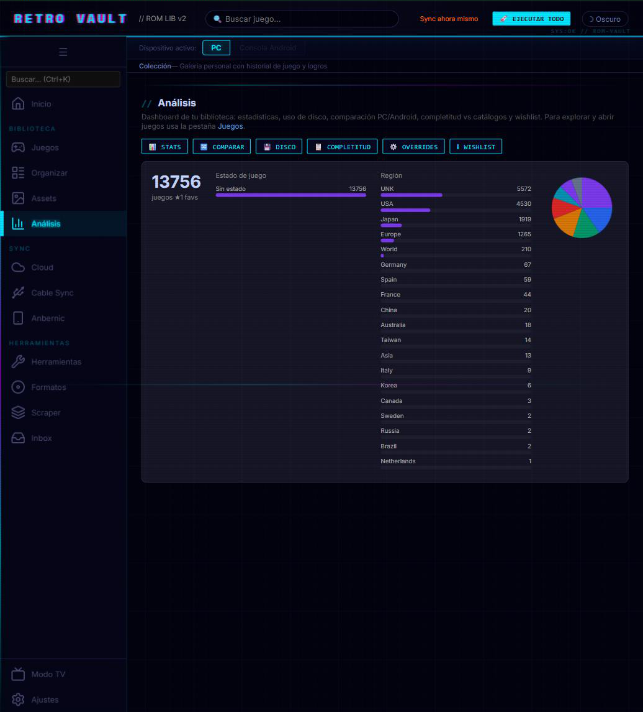
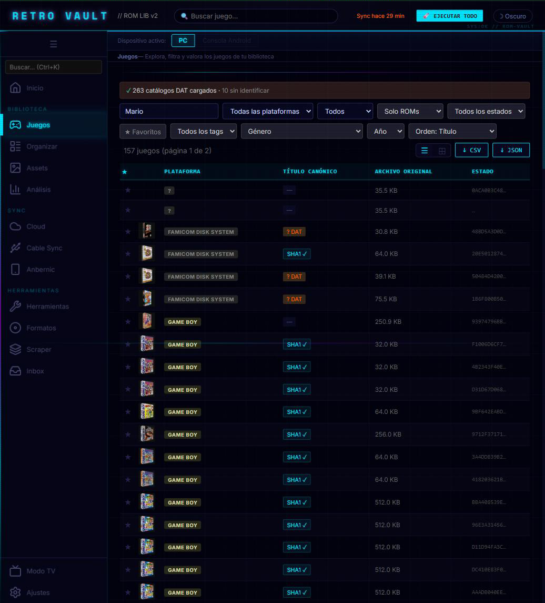
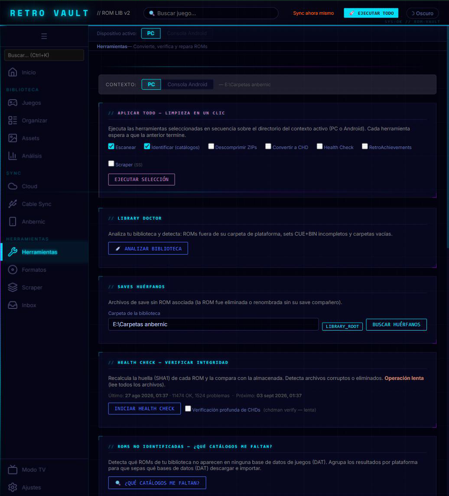

# Retro Vault

> **TL;DR (English):** Local Python tool with a web UI that turns a messy ROM folder into an organized retro game library — automatic identification against No-Intro/Redump catalogs, metadata and cover art scraping, and cloud/USB **save-game sync** between PC and Android handhelds (like Steam Cloud, but for emulators).
> **Stack:** Python 3.12 (stdlib only, zero runtime dependencies), SQLite, vanilla JS web UI, GitHub Actions CI. Docs are in Spanish.

## ¿Por qué existe esto?

Soy aficionado a los videojuegos retro y tengo una consola portátil Android (Anbernic) además del PC. El problema era siempre el mismo: terminar una partida en el PC y no poder continuarla en la consola, o tener cientos de ROMs sin organizar, con nombres crípticos, duplicados y sin carátulas.

Decidí resolver ese problema construyendo la herramienta que necesitaba. El resultado es Retro Vault: una aplicación que organiza tu colección de forma automática, descarga los metadatos y carátulas de cada juego, y mantiene tus partidas guardadas sincronizadas entre el PC y la consola, igual que hace Steam con sus juegos en la nube, pero para emuladores retro.

Este proyecto nació también como forma de demostrar lo que soy capaz de hacer después de formarme en IA y desarrollo de software: resolver problemas reales con código real.

**Gestiona, organiza y sincroniza tu colección de ROMs retro.**

Retro Vault es una herramienta local en Python con interfaz web que convierte una carpeta caótica de ROMs en una biblioteca identificada, organizada por plataforma, con metadatos, carátulas y — lo más importante — con los **saves sincronizados automáticamente** entre tu PC y tu consola portátil Android.

```
http://127.0.0.1:7777
```

---

## Capturas

| Análisis | Juegos | Herramientas |
|---|---|---|
| [](docs/screenshots/analisis.png) | [](docs/screenshots/juegos.png) | [](docs/screenshots/herramientas.png) |

---

## ¿Qué hace?

### El flujo habitual

```
ROM nueva en inbox/
    ↓  Inbox: identifica plataforma, descomprime, renombra
    ↓  Scan: hashea SHA1+MD5+CRC32, inventaría en SQLite
    ↓  Match: cruza con catálogos No-Intro / Redump
    ↓  Plan → Apply: renombra a nombre canónico (atómico, con rollback)
    ↓  Scraper: descarga metadatos + carátulas de ScreenScraper
    ↓  gamelist.xml para EmulationStation / ES-DE
    ↓  RetroAchievements: comprueba compatibilidad de logros por MD5
Biblioteca organizada
    ↓  Cloud Sync: saves ↔ Dropbox ↔ consola Android (vía rclone)
    ↓  Cable Sync: ROMs + saves ↔ consola por USB (sin WiFi)
Colección en todos tus dispositivos
```

---

## Características

### Escaneo e inventario
- Escaneo recursivo con clasificación automática: ROM / save / asset / BIOS / desconocido
- Hashing triple: **SHA1 + MD5 + CRC32** por cada ROM
- **Incremental**: omite el re-hasheo si mtime y tamaño no cambiaron
- Base de datos SQLite en `.rommgr/library_pc.db` — sobrevive re-escaneos mediante upsert
- Limpieza automática de entradas huérfanas al finalizar cada escaneo
- Modo rápido (`--quick`) sin hashing para escaneos instantáneos

### Identificación y renombrado
- Matching por SHA1 contra catálogos **No-Intro** y **Redump** en formato DAT XML Logiqx
- `Plan` para previsualizar, `Apply` para ejecutar — nunca sobreescribe sin confirmar
- Renombrado **atómico con rollback**: si algo falla, los archivos vuelven a su estado original
- Los saves se renombran junto al ROM (mismo stem) para no perder el progreso
- **PSX**: nunca renombra `.bin` sin reescribir el `.cue`; genera `.m3u` para sets multi-disco
- Detección y resolución de conflictos de nombre (mismo título canónico, ROMs distintos)

### Conversión y herramientas de biblioteca
- Conversión `.cue+.bin` → `.chd` vía `chdman` (sets PSX, Saturn, Dreamcast)
- Extracción de `.zip`
- Generador de playlists `.m3u` para sets multi-disco
- Verificación de integridad de sets multi-disco
- Búsqueda de saves huérfanos (sin ROM asociada)
- Health check: re-hashea ROMs contra el SHA1 almacenado para detectar corrupción
- **Escaneo de archivos basura**: detecta y elimina `.DS_Store`, thumbs, temporales, etc.
  Clasificador basado en evidencia (BD + catálogos + XML de MAME) con etiquetas de
  confianza: `safe_delete` (borrable en masa), `review` y `misplaced` (mover, no borrar)
- **Identificación de ZIPs sueltos sin descomprimir** (ZIP-ROUTE): el CRC32 del header
  del ZIP se cruza con No-Intro/Redump (juegos de consola), con los DATs arcade por
  votación (sets MAME/FBNeo renombrados) y con la extensión interna (romhacks);
  las colecciones se detectan por contenido (zip-de-zips / `.chd`)
- **Organizar identificados en un paso**: arcade directo a `arcade\` renombrado al set
  (el ZIP nunca se extrae: es el ROM), colecciones extraídas a su destino y el resto
  vía Inbox (emparejar → renombrar → mover); el Inbox queda limpio, sin duplicados,
  y los conflictos se reportan sin sobreescribir nada

### Estructura de biblioteca (ES-DE compatible)
- Crea automáticamente la estructura de carpetas estándar ES-DE/EmulationStation:
  `psx/ gba/ snes/ megadrive/ ...` + `saves/ bios/ inbox/ media/`
- **Organizar biblioteca**: mueve ROMs existentes a su carpeta de plataforma y actualiza la BD
- `gamelist.xml` en cada carpeta de plataforma con metadatos y rutas de carátulas

### Metadatos y logros
- Scraping desde **ScreenScraper** (título, año, género, publisher, portadas, vídeos)
- Exportación de `gamelist.xml` formato EmulationStation / ES-DE
- Comprobación de compatibilidad con **RetroAchievements** por MD5
  - Caché local de 1 semana para no agotar la API
  - Filtro por plataforma en los resultados
  - Identifica qué versión de tus ROMs es la compatible con logros
  - Exportación CSV
  - **Progreso personal** — muestra `X / Y logros desbloqueados (Z%)` en el panel de juego, con caché de 1h

### Sincronización en la nube
- **Multi-fuente**: cada emulador tiene su propia carpeta de saves y su propio path remoto
- Política de conflictos: el archivo más reciente gana; ante ambigüedad, se guardan ambas versiones con sufijo timestamp
- Soporte para Dropbox, OneDrive, Google Drive y cualquier remoto rclone
- Log de operaciones de sync almacenado en SQLite

### App Android nativa (en desarrollo)
- Kotlin + Jetpack Compose en `android/` — sync de saves en segundo plano, sin depender de Termux ni de tener el PC encendido
- Conexión a Dropbox por OAuth PKCE, credenciales en `EncryptedSharedPreferences`
- Motor de sync propio (mismo `ConflictResolver` que el resto de la app: newest-wins con tolerancia de 2s y backup de conflicto) con watermark en Room
- Pantalla de Ajustes: conectar/desconectar Dropbox, paths remotos, sync manual
- Sync periódico vía `WorkManager` (`CoroutineWorker`, mínimo 15 min, solo con red) con interruptor en Ajustes
- En progreso: sync instantáneo por `FileObserver` al detectar un save nuevo, servicio en primer plano, arranque tras reboot
- Detalle técnico y estado de cada pieza: sección **ANDROID-SYNC** en [`Tareas/backlog.md`](Tareas/backlog.md)

### Cable Sync (USB directo)
- Copia ROMs y/o saves entre PC y consola Android por USB, sin WiFi
- Tres modos: PC→Consola, Consola→PC, el más reciente gana
- Filtros: solo saves, solo ROMs, o todo
- Deduplicación por SHA1: nunca copia algo que ya está en el destino

### Colección
- Galería de portadas con sorting por plataforma, título o "Jugados recientemente"
- Tiles con **rating de 5 estrellas**, sesiones detectadas y fecha de último juego
- Panel de detalle por juego: notas, tags, historial de sync, logros de RA, backup de saves
- **UI TV-friendly** para la pestaña Sync — tres pasos grandes (Estado → Sync → Resultado) optimizados para consolas/pantallas táctiles

### Interfaz web
- SPA embebida — **sin dependencias externas de runtime**, solo Python stdlib
- Operaciones pesadas en background con barra de progreso en tiempo real
- Dos bases de datos independientes: una para el PC y otra para la consola Android

---

## Emuladores compatibles (multi-sync)

| Plataformas | PC | Android (consola) | Saves compatibles |
|---|---|---|---|
| NES · SNES · MD · N64 · GB/GBC/GBA · DS · Dreamcast · Saturn | RetroArch | RetroArch | ✅ Mismos cores → 100% |
| PlayStation (PSX) | DuckStation | DuckStation Android | ⚠️ `.mcd`, requiere mover el directorio de memcards a una carpeta pública (ver [`docs/emulator-compat.md`](docs/emulator-compat.md)) |
| PlayStation 2 | PCSX2 | NetherSX2 | ✅ `.ps2` |
| PSP | PPSSPP | PPSSPP Android | ✅ `SAVEDATA/` completo |
| Nintendo DS | MelonDS | MelonDS Android | ✅ `.sav` |
| GameCube / Wii | Dolphin | Dolphin Android | ✅ `.gci` + NAND |

---

## Instalación

### Opción rápida (Windows, sin Python)

Descarga `RetroVault-Setup.exe` de la [última release](https://github.com/Rcerezo-dev/Retro-gaming-companion/releases/latest), ejecútalo (instala por usuario, sin permisos de administrador) y abre **Retro Vault** desde el acceso directo. Incluye `adb`, `chdman`, `rclone` y catálogos DAT de 34 plataformas — no hace falta instalar nada más. Detalle: [`docs/guia-pruebas.md`](docs/guia-pruebas.md#0-ruta-a--instalación-en-un-pc-limpio-sin-python).

### Requisitos (instalación desde código fuente)
- **Python 3.11+** (recomendado 3.12)
- **rclone** — para cloud sync ([rclone.org](https://rclone.org/))
- **chdman** v0.286+ — para convertir a CHD ([MAME tools](https://www.mamedev.org/tools/))
- **adb** — opcional, para Cable Sync por USB ([Android Platform Tools](https://developer.android.com/tools/releases/platform-tools))

### Instalación rápida

```bash
git clone https://github.com/Rcerezo-dev/Retro-gaming-companion.git
cd Retro-gaming-companion
pip install -e .
```

**Con Conda (recomendado en Windows):**

```bash
conda create -n rom_manager python=3.12
conda activate rom_manager
pip install -e .
```

**Lanzador Windows (sin activar entorno):**

```bat
scripts\rommgr.cmd serve
```

### Binarios externos

Coloca los binarios en `tools/` o añádelos al PATH:

```
tools/
  chdman.exe     ← descargar de mamedev.org/tools
  adb.exe        ← descargar de developer.android.com/tools
```

---

## Configuración

Copia [`config.toml.example`](config.toml.example) a `config.toml` en la raíz
del proyecto y ajusta las rutas — el example documenta **todas** las claves
soportadas con sus defaults. La pestaña **Ajustes** de la interfaz web edita
el archivo por ti, así que lo mínimo para arrancar es:

```toml
[library]
library_root = "E:\\ROMs"    # Raíz de la biblioteca

# Una entrada por emulador cuyos saves quieras sincronizar con la nube
[[sync.sources]]
name      = "RetroArch"
local_dir = "E:\\ROMs\\saves"
remote    = "dropbox:/RetroSync/saves/retroarch"
```

---

## Uso

### Interfaz web (recomendado)

```bash
rommgr serve
# Abre http://127.0.0.1:7777
```

| Pestaña | Descripción |
|---------|-------------|
| **Inicio** | Dashboard: totales, % match, espacio, KPIs por estado de juego. Sugerencia "¿A qué juego hoy?" ponderada. Botón de escaneo con progreso en tiempo real. |
| **Juegos** | Tabla o galería (toggle) filtrable por plataforma, región y estado. Búsqueda por título o archivo. Panel de detalle con rating ★, tags, notas y progreso RA. |
| **Organizar** | Preview de renombrados y conflictos, botón Apply (con "Deshacer último apply"). Pantalla "Revisar copias": duplicados por SHA1, versiones distintas y colisiones en una sola cola con recomendación precalculada. |
| **Assets** | Cobertura de carátulas/vídeos/XML por plataforma; huérfanos y ROMs sin assets. |
| **Análisis** | Dashboard de biblioteca: estadísticas, uso de disco, comparación PC↔Android, completitud vs. catálogos DAT y wishlist. |
| **Cloud** | Cloud sync multi-emulador. Estado por fuente (RetroArch, DuckStation, PPSSPP, cheats, config…). Log de operaciones. |
| **Cable Sync** | Copia directa PC ↔ consola Android por USB. Tres modos de dirección. UI TV-friendly para consolas táctiles. |
| **Anbernic** | Setup guiado de la consola (Termux/rclone) desde el PC, sin escribir comandos a mano. |
| **Herramientas** | CHD, ZIP, M3U, verificación multi-disco, health check, backup BD, estructura de carpetas, compatibilidad RetroAchievements por MD5. Junk-scan con identificación de ZIPs por CRC y botón "Organizar identificados (1 paso)". |
| **Formatos** | Conversión y parches: CHD, CSO, N64, aplicador IPS/BPS/UPS. |
| **Scraper** | Descarga metadatos y carátulas desde ScreenScraper. Exporta `gamelist.xml`. |
| **Inbox** | Procesa ZIPs nuevos: identifica plataforma, descomprime y organiza automáticamente. |
| **Modo TV** | Navegación fullscreen con mando/teclado, pensada para pantalla de salón. |
| **Ajustes** | Rutas, credenciales, extensiones de save, config de sync automático (saves, cheats, config RetroArch, playtime). Descarga automática de DATs. |

### CLI

```bash
rommgr serve                            # Arranca la interfaz web
rommgr scan <ruta> [--quick]            # Escanea una carpeta
rommgr status                           # Resumen de la biblioteca
rommgr match                            # Cruza con catálogos DAT
rommgr plan                             # Previsualiza renombrados
rommgr apply                            # Ejecuta renombrados
rommgr duplicates                       # Lista duplicados por SHA1
rommgr report --format json             # Genera reporte de biblioteca
rommgr convert-chd <ruta> --apply       # Convierte PSX a CHD
rommgr sync-saves --apply               # Sincroniza saves con la nube
```

---

## Estructura de biblioteca recomendada

Compatible con **EmulationStation / ES-DE** en PC y Android:

```
library_root/
├── psx/
│   ├── gamelist.xml           ← generado por el Scraper
│   ├── media/
│   │   ├── images/            ← carátulas (mismo nombre que el ROM)
│   │   └── videos/
│   └── Final Fantasy VII (USA).chd
├── gba/
│   └── Metroid Fusion (USA).gba
├── snes/
├── megadrive/
├── n64/
├── nds/
├── gamecube/
├── ...
├── saves/                     ← TODOS los saves de RetroArch (planos)
├── bios/                      ← BIOS (scph1001.bin, etc.)
└── inbox/                     ← ZIPs nuevos sin organizar
```

El botón **"Crear estructura"** en Herramientas → Estructura de biblioteca crea todas las carpetas automáticamente.

> **Nota sobre RetroArch PC:** configura Settings → Saving → Savefile Directory apuntando a `library_root/saves/` para que los saves queden centralizados y el cloud sync funcione sin fricción.

---

## Sincronización de saves

### Cloud sync (PC ↔ Nube ↔ Android)

1. Configura rclone con tu servicio preferido: `rclone config`
2. Añade las entradas `[[sync.sources]]` en `config.toml` (ver arriba)
3. En la pestaña **Sync** → pulsa **Sincronizar**

La Anbernic / consola Android usa la misma cuenta de rclone configurada en Termux. Guía detallada: [`docs/sync/sync-cloud.md`](docs/sync/sync-cloud.md) · [`docs/sync/Guia-Termux-Anbernic.md`](docs/sync/Guia-Termux-Anbernic.md).

### Cable sync (PC ↔ Android por USB)

Opciones para montar el almacenamiento Android en Windows:
1. **Tarjeta SD en lector** — el método más rápido y fiable
2. **Termux SFTP** — `sshd` en Termux + WinFsp/SSHFS-Win o `rclone mount`
3. **ADB** — modo directo, no requiere montar unidad

El modo MTP estándar ("Transferencia de archivos") **no** expone una letra de unidad y no es compatible. Guía: [`docs/sync/sync-cable.md`](docs/sync/sync-cable.md).

---

## Catálogos DAT

```
.rommgr/
  catalogs/
    nointro/   ← DATs de cartuchos (GB, GBC, GBA, NES, SNES, N64, DS…)
    redump/    ← DATs de disco (PSX, PS2, PSP, GameCube, Dreamcast…)
```

Puedes descargar los DATs manualmente desde [No-Intro](https://www.no-intro.org/) y [Redump](http://redump.org/), o usar el botón integrado en **Ajustes → Catálogos DAT → Descarga automática**: selecciona los sistemas que quieres (o pulsa "Descargar todos") y los DATs se descargan directamente desde [libretro-database](https://github.com/libretro/libretro-database) (MIT), con barra de progreso en tiempo real.

El matcher usa SHA1 para encontrar coincidencias exactas.

---

## Estructura del proyecto

```
src/rom_manager/
  cli.py                     # Entrypoint CLI (argparse)
  config.py                  # AppConfig + SyncSource + lectura de config.toml
  catalog/                   # Parseo DATs + matching SHA1
  database/                  # Schema SQLite + LibraryRepository
  detection/                 # Clasificación de archivos, plataforma, región
  hashing/                   # SHA1 + MD5 + CRC32
  scanner/                   # Escaneo incremental
  planner/                   # RenamePlan: pending / already_correct / conflicts
  renamer/                   # Renombrado atómico + reescritura .cue
  converters/                # CHD, ZIP
  utils/                     # M3U, multi-disco, orphan finder, health check
  sync/                      # rclone transport, save syncer, conflict resolver
  scraper/                   # ScreenScraper, gamelist.xml, Pegasus
  retroachievements/         # RA API client + MD5 checker
  web/                       # ThreadingHTTPServer + SPA HTML/JS
android/                     # App Android nativa (Kotlin/Compose) — sync de saves en segundo plano
scripts/
  rommgr.cmd / rommgr.ps1   # Lanzadores Windows
tools/
  chdman.exe / adb.exe       # Binarios externos (no incluidos en el repo)
docs/
  architecture/              # Arquitectura técnica y diseño
  config/                    # Estructura de biblioteca, ES-DE, rutas de referencia
  sync/                      # Guías de sincronización (cable, cloud, Termux, ADB)
  ideas/                     # Propuestas y visión del producto
  _archive/                  # Documentos obsoletos
Tareas/
  backlog.md                 # Backlog activo
  archivo.md                 # Tareas completadas
  diario/                    # Diario de sesiones de trabajo
```

---

## Tests

```bash
pytest
# o con el lanzador Windows:
scripts\rommgr.cmd pytest tests/ -v
```

---

## Hoja de ruta

| Fase | Descripción | Estado |
|------|-------------|--------|
| 1 | Escaneo, hashing, inventario SQLite, CLI básico | ✅ |
| 2 | Matching SHA1 contra catálogos No-Intro y Redump | ✅ |
| 3 | Plan + Apply — renombrado seguro + conversión CHD | ✅ |
| 4 | Duplicados, escaneo incremental, reportes, interfaz web | ✅ |
| 5 | Cloud sync · Cable Sync · ScreenScraper · RetroAchievements | ✅ |
| 6 | Multi-source sync · Estructura ES-DE · Inbox · Fix duplicados | ✅ |
| 7 | Wizard unificado · Sync Anbernic TV · Cloud (Termux+rclone) · Galería con ratings · DAT auto-download · Progreso RA personal | ✅ |
| 8 | PyInstaller exe · instalador Windows · auto-update · PIN de acceso | ✅ |
| 9 | ZIP-ROUTE · JUNK-SMART · pantalla "Revisar copias" unificada · deshacer apply · backup automático de BD · playtime real · recomendador de juego · auditorías UX de casi toda la interfaz | ✅ |
| 10 | App Android nativa (Kotlin/Compose): permisos, escaneo local, Dropbox OAuth + sync engine propio, pantalla de Ajustes, sync periódico vía WorkManager | 🚧 en progreso |

Última release: [**v1.1.0**](https://github.com/Rcerezo-dev/Retro-gaming-companion/releases/latest) — ver [`CHANGELOG.md`](CHANGELOG.md).
Ver [`Tareas/backlog.md`](Tareas/backlog.md) para el detalle de tareas activas.

---

## Documentación

Toda la documentación técnica (arquitectura, configuración, guías de sync,
CI/CD y desarrollo) está indexada en [`docs/README.md`](docs/README.md).
¿Quieres contribuir? Empieza por [`CONTRIBUTING.md`](CONTRIBUTING.md), sigue con
[`docs/onboarding.md`](docs/onboarding.md) (tus primeros 30 minutos en el código)
y ten a mano [`docs/glossary.md`](docs/glossary.md) para la jerga retro.

---

## Licencia

[MIT](LICENSE)
